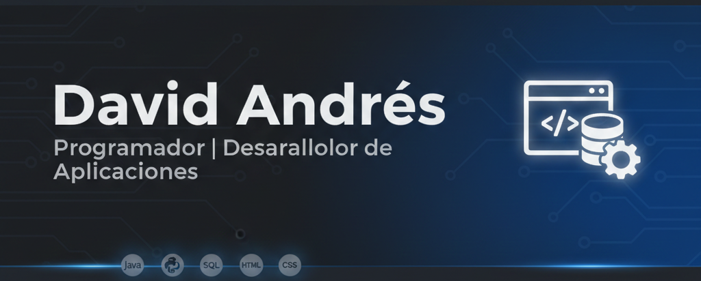

<h1 align = "center"> Hola soy David Andrés 👋 </h1>

### 🛠️ Tecnologías y herramientas
    

---

## 👨‍💻 Sobre mí
Estudie Desarrollo de aplicaciones multiplataforma.
Desarrollador Junior enfocado en el sector android y escritorio, cuento con conocimientos sobre front con el uso de html y css

## 🚀 Proyectos Destacados
* **[Aplicacion gestion de recetas
* **[Juegos Mario Bros (Swing)](URL_AQUÍ):** Aplicación de escritorio con gestión de hilos y lógica de juegos.
* **[Portal Web Grupal](URL_AQUÍ):** Colaboración en el desarrollo de la sección de noticias, merchan y footer.

